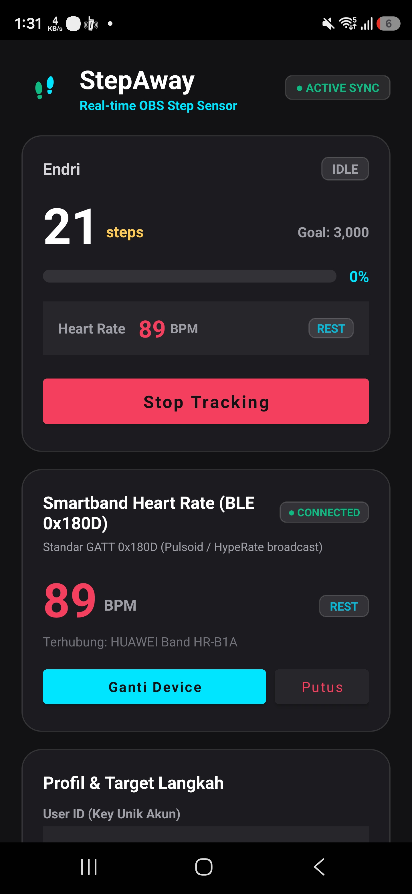

# StepAway: Real-time OBS Step Counter & Heart Rate Overlay System

Sistem overlay OBS multi-user SaaS dan aplikasi Android untuk menampilkan sensor langkah kaki serta detak jantung (Heart Rate BLE 0x180D) streamer secara real-time. Dilengkapi landing page interaktif, otentikasi Google OAuth 2.0, scan QR sync aplikasi mobile, integrasi webhook donasi TipTap.gg subathon, sistem room multi-streamer, dan 3 varian widget home screen Android.

Dibuat dan dikelola oleh **@endrisusanto**.

---

## Tangkapan Layar (Screenshots)

### 1. Widget Home Screen Android & Aplikasi Mobile
| 3 Varian Widget Homescreen | Aplikasi Android StepAway |
| :---: | :---: |
|  |  |
| *Widget Combo 4x2, Step 2x2, dan Heart Rate 2x2* | *Kontrol tracking, scanner smartband BLE, dan simulator* |

### 2. Web Dashboard & Live Preview
| Dashboard Streamer & Live Overlay Preview | Multi-User Room Overlay |
| :---: | :---: |
| .png) | .png) |
| *Preview interaktif, tab switcher, dan simulator* | *Mode co-op / battle multi streamer* |

---

## Fitur Utama

1. **SaaS Multi-User & Google OAuth 2.0**:
   - Landing page modern dengan live interactive widget preview.
   - Sistem login/register dengan Email & Password atau Google OAuth 2.0 langsung.
   - Proteksi sesi aman berbasis HttpOnly cookie (`stepaway_session`).
   - Modal Scan QR Code di Dashboard untuk sinkronisasi otomatis akun ke aplikasi Android.

2. **Real-time Step Counter & Cadence**:
   - Membaca sensor langkah kaki bawaan smartphone Android secara akurat.
   - Deteksi ritme aktivitas otomatis: `IDLE`, `WALKING`, dan `RUNNING`.
   - Efek visual floating pop-up angka per langkah dan animasi milestone target tercapai.

3. **Smartband Heart Rate Broadcast (BLE GATT 0x180D)**:
   - Integrasi protokol standar BLE (kompatibel dengan Mi Band, Garmin, Polar, HypeRate/Pulsoid broadcast).
   - Klasifikasi zona latihan otomatis: `REST`, `AEROBIC`, `ANAEROBIC`, dan `PEAK`.
   - Proteksi auto-disconnect: Menampilkan `-` saat smartband terputus.

4. **Integrasi Webhook TipTap.gg Subathon**:
   - Webhook unik per-user (`/api/webhooks/tiptap?userId=<ID>`) dengan verifikasi token.
   - Mengonversi donasi menjadi penambahan target langkah (*step goal*) atau bonus langkah realtime di OBS.
   - Alert visual pop-up donatur dan sintesis audio chime lembut di OBS.

5. **Draggable Overlay Cards & Desain Atletik**:
   - Seluruh kartu widget pada overlay OBS dapat digeser secara bebas (*drag and drop*) menggunakan mouse atau sentuhan.
   - Indikator status koneksi terintegrasi pada logo aplikasi.

6. **3 Varian Widget Android Home Screen**:
   - **StepAway Combo (4x2)**: Menampilkan langkah, goal progress bar, chip Heart Rate (BPM), dan status ritme.
   - **Step Tracker (2x2)**: Monitor langkah ringkas dengan angka hero besar, progress bar, dan persentase target.
   - **Heart Rate (2x2)**: Monitor detak jantung real-time (BPM) dengan indikator zona intensitas kardio.

7. **Multi-User Room System**:
   - Kolaborasi tracking atau battle langkah antar streamer via Room ID (publik maupun private).

---

## Struktur Folder

```text
StepAway/
├── Dockerfile                  # Multi-stage Docker build untuk Node.js server
├── docker-compose.yml          # Konfigurasi container service & port mapping (3344:3000)
├── package.json                # Dependensi Express, WebSocket, Cookie-Parser, & Bcryptjs
├── server.js                   # REST API SaaS, Google OAuth, WebSocket Hub, & TipTap Webhook
├── release.sh                  # Script rilis otomatis & pemicu GitHub Actions
├── data/                       # Database disk persistence (storage.json)
├── docs/screenshots/           # Direktori aset tangkapan layar dokumentasi
├── public/
│   ├── index.html              # Landing page SaaS modern & portal login
│   ├── dashboard.html          # Streamer control panel, live preview, & QR sync
│   ├── overlay.html            # OBS Browser Source Step Counter (+ HR Combo)
│   ├── overlay-heartrate.html  # OBS Browser Source Standalone Heart Rate (BPM)
│   ├── overlay-multi.html      # OBS Browser Source Multi-User Room
│   ├── favicon.svg             # Favicon vektor solid
│   ├── css/
│   │   ├── landing.css         # Styling landing page responsif
│   │   ├── dashboard.css       # Styling control panel fullwidth responsif
│   │   └── overlay.css         # Styling widget OBS transparan & font atletik
│   └── js/
│       ├── landing.js          # Client auth modal & landing page showcase
│       ├── dashboard.js        # Logika simulator, WebSocket client, & resize controller
│       ├── draggable.js        # Modul interaktif drag and drop repositioning
│       ├── overlay.js          # Client step overlay & particle animator
│       ├── overlay-heartrate.js# Client heart rate overlay & beat synchronizer
│       └── overlay-multi.js    # Client room grid multi-user
└── android/                    # Source code Kotlin Android StepAway Tracker App
    ├── app/src/main/
    │   ├── AndroidManifest.xml # Izin activity recognition, BLE, & 3 widget receivers
    │   ├── java/com/endrisusanto/stepaway/
    │   │   ├── MainActivity.kt            # Control panel Android, scanner BLE, & simulator
    │   │   ├── BleHeartRateManager.kt     # Scanner & GATT client 0x180D BLE Smartband
    │   │   ├── StepSensorService.kt       # Background sensor foreground service & sync
    │   │   ├── StepAwayWidgetProvider.kt  # Provider Combo Widget (4x2)
    │   │   ├── StepCompactWidgetProvider.kt # Provider Step Tracker (2x2)
    │   └── HeartRateWidgetProvider.kt # Provider Heart Rate Widget (2x2)
    └── README.md
```

---

## Konfigurasi Lingkungan (.env)

Buat file `.env` berdasarkan file `.env.example`:

```bash
PORT=3000
NODE_ENV=production
SESSION_SECRET=ganti_dengan_random_secret_yang_panjang_dan_aman

# Google OAuth 2.0 Credentials
GOOGLE_CLIENT_ID=your_google_client_id_here.apps.googleusercontent.com
GOOGLE_CLIENT_SECRET=your_google_client_secret_here
BASE_URL=https://stepaway.endrisusanto.my.id
```

### Pengaturan Google Cloud Console:
1. Buka [Google Cloud Console](https://console.cloud.google.com/apis/credentials).
2. Buat **OAuth 2.0 Client ID** (Web application).
3. Isi **Authorized JavaScript origins**:
   ```text
   https://stepaway.endrisusanto.my.id
   ```
4. Isi **Authorized redirect URIs**:
   ```text
   https://stepaway.endrisusanto.my.id/api/auth/google/callback
   ```

---

## Panduan Menjalankan Server (Docker)

1. **Jalankan Container**:
   ```bash
   docker compose up -d --build
   ```

2. **Periksa Status Container**:
   ```bash
   docker compose ps
   ```
   Web server akan aktif di port `3344` (`http://localhost:3344`).

3. **Konfigurasi Reverse Proxy (Nginx)**:
   Hubungkan domain Anda ke port `3344` dengan konfigurasi WebSocket:

   ```nginx
   server {
       server_name stepaway.endrisusanto.my.id;

       location / {
           proxy_pass http://127.0.0.1:3344;
           proxy_http_version 1.1;
           proxy_set_header Upgrade $http_upgrade;
           proxy_set_header Connection "upgrade";
           proxy_set_header Host $host;
           proxy_cache_bypass $http_upgrade;
       }
   }
   ```

---

## URL Browser Source OBS Studio

Tambahkan Browser Source baru di OBS Studio dengan tautan berikut (ganti `streamer` dengan User ID akun Anda):

| Tipe Widget | URL Browser Source | Rekomendasi Resolusi |
| :--- | :--- | :--- |
| **Step Counter** | `https://stepaway.endrisusanto.my.id/overlay?user=streamer` | 420 x 140 px |
| **Heart Rate Standalone** | `https://stepaway.endrisusanto.my.id/overlay/heartrate?user=streamer` | 240 x 90 px |
| **Step + Heart Rate Combo** | `https://stepaway.endrisusanto.my.id/overlay?user=streamer&show_hr=true` | 420 x 140 px |
| **Multi-User Room Overlay** | `https://stepaway.endrisusanto.my.id/overlay/multi?room=walk-squad` | 420 x 360 px |
| **Test Preview Demo** | `https://stepaway.endrisusanto.my.id/overlay?user=streamer&test=true` | 420 x 140 px |

*Catatan: Seluruh overlay memiliki background transparan dan kartu widget dapat digeser langsung di viewport preview OBS.*

---

## Integrasi Donasi TipTap.gg (Subathon Step Goal)

StepAway mendukung integrasi webhook donasi dari platform **TipTap.gg** untuk mengonversi nominal donasi menjadi penambahan target langkah (*step goal*) atau bonus langkah dengan alert realtime di OBS.

### 1. Cara Mengatur Webhook di TipTap.gg
1. Buka dashboard akun [TipTap.gg](https://docs.tiptap.gg/en/webhook) dan masuk ke menu **Settings > Webhook**.
2. Masukkan **Webhook URL** akun Anda:
   ```text
   https://stepaway.endrisusanto.my.id/api/webhooks/tiptap?userId=streamer
   ```
3. Pilih event **Donation** (atau centang semua event transaksi donasi).
4. Salin Webhook Secret Token TipTap dan masukkan ke form pengaturan donasi di Web Dashboard StepAway untuk verifikasi keamanan.

### 2. Mode Konversi Langkah
- **Subathon Goal Booster (Default)**: Setiap donasi masuk menambah target langkah yang harus diselesaikan streamer (contoh: Rp 10 = 1 Step. Donasi Rp 50.000 menambah +5.000 Target Langkah).
- **Community Step Booster**: Setiap donasi masuk langsung menambahkan akumulasi jumlah langkah saat ini.

### 3. Fitur Alert OBS & Simulator
- **Visual Alert Pop-up**: Menampilkan kartu pop-up donatur, nominal, pesan donasi, dan badge tambahan target (`+N Goal`).
- **Audio Chime**: Sintesis suara lembut (Web Audio API) otomatis berbunyi saat donasi masuk.
- **Simulator Uji Coba**: Tersedia tombol test donasi cepat (+Rp 10.000, +Rp 50.000, +Rp 100.000) di Web Dashboard untuk menguji respons visual tanpa perlu transaksi riil.

---

## Panduan Penggunaan Aplikasi Android

1. Download dan instal file APK StepAway (`StepAway-vX.X.X.apk`) dari halaman Releases GitHub.
2. Buka aplikasi dan atur **User ID (Key Unik)** atau scan QR code dari Web Dashboard.
3. Hubungkan Smartband/Sensor Detak Jantung via tombol **Scan Smartband** (standar GATT BLE 0x180D).
4. Tekan tombol **Start Tracking**. Sensor langkah dan detak jantung akan berjalan di background service serta menyiarkan data secara real-time ke server OBS.
5. Tambahkan widget di Home Screen Android untuk memantau capaian langkah dan detak jantung live tanpa harus membuka aplikasi.

---

## Kontributor & Lisensi

Dikembangkan dan dikelola oleh **@endrisusanto**.  
Lisensi: MIT.
